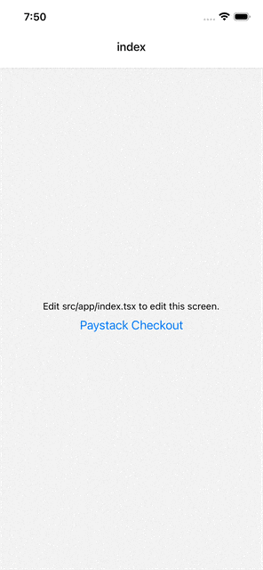

# react-native-paystack-modal


A lightweight Paystack checkout SDK for **React Native and Expo** that opens the Paystack **InlineJS checkout** inside a **WebView popup modal**.

The library is **fully type-safe**, requires **no provider setup**, and works in both **Expo and bare React Native apps**.

---

## Preview

Paystack checkout opens inside a **React Native modal WebView**.



---

# Features

- Works with **Expo**
- Opens Paystack checkout in a **popup WebView modal**
- **Fully TypeScript typed**
- **No Provider required**
- Supports **all Paystack InlineJS transaction methods**
- Handles **success, cancel, and error events**
- Minimal setup

---

# Installation

```bash
npm install react-native-paystack-modal
```

Install WebView if not already installed:

```bash
expo install react-native-webview
```

or

```bash
npm install react-native-webview
```

---

# Setup

Add the modal host once in your root component.

```tsx
import { PaystackModalHost } from "react-native-paystack-modal";

export default function App() {
  return (
    <>
      <YourApp />
      <PaystackModalHost />
    </>
  );
}
```

---

# Basic Usage

```ts
import { Paystack } from "react-native-paystack-modal";

Paystack.newTransaction({
  key: "pk_test_xxxx",
  email: "customer@email.com",
  amount: 500000,

  onSuccess: (response) => {
    console.log("Payment success", response);
  },

  onCancel: () => {
    console.log("Payment cancelled");
  },

  onError: (error) => {
    console.error("Payment error", error);
  }
});
```

---

# Async Usage

You can also use async/await if preferred.

```ts
try {
  const response = await Paystack.checkout({
    key: "pk_test_xxxx",
    email: "customer@email.com",
    amount: 500000
  });

  console.log(response);
} catch (err) {
  console.log(err);
}
```

---

# Supported Methods

| Method | Description |
|------|-------------|
| `checkout()` | Async checkout flow |
| `newTransaction()` | Standard Paystack transaction |
| `resumeTransaction()` | Resume server initialized payment |
| `preloadTransaction()` | Preload checkout modal |
| `cancelTransaction()` | Cancel transaction |
| `paymentRequest()` | Wallet payment request |

This SDK supports **all Paystack InlineJS transaction methods**.

See the official Paystack InlineJS documentation:  
<https://paystack.com/docs/payments/accept-payments/#inline>

---


## How It Works

This library loads **Paystack InlineJS** inside a **React Native WebView** and presents it as a **modal popup**.

This approach allows the SDK to:

- Work with **Expo**
- Avoid native SDK linking
- Stay **lightweight**
- Remain **fully type-safe**

---

# Requirements

- React Native `>=0.72`
- React `>=18`
- `react-native-webview`

---

# License

MIT
# react-native-paystack-modal
